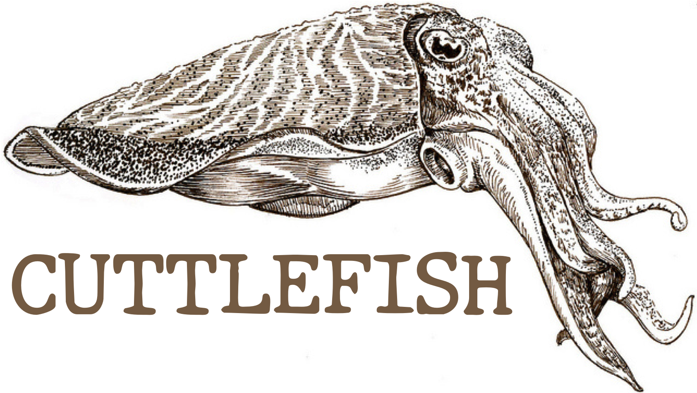

Cuttlefish is a system that makes Partial Homomorphic Encryption practical. 
Cuttlefish uses the abstraction of Secure Data Types to enable a set of compilation techniques 
and efficiently compute data analytics queries in public cloud infrastructures while keeping 
sensitive data confidential. In cases where Partial Homomorphic Encryption (PHE) is not expressive
enough to execute a query, Cuttlefish resorts to client-side completion, client-side 
re-encryption, or secure hardware-based re-encryption based on Intel’s SGX when available.

This project is based on our SoCC 2017 paper.

Savvas Savvides, Julian Stephen, Masoud Saeida Ardekani, Vinai Sundaram, Patrick Eugster  
[Secure data types: a simple abstraction for confidentiality-preserving data analytics](https://dl.acm.org/citation.cfm?id=3127479.3129256)  
SoCC '17 Proceedings of the 2017 Symposium on Cloud Computing  
Santa Clara, California — September 24 - 27, 2017 

This repo includes an example evaluation of _TPC-H_ using Cuttlefish that compares the _plaintext_
execution to the _PHE_ execution.

## Installation
First download the Cuttlefish codebase and set the environment variable `CUTTLEFISH_HOME` to point 
to the top directory of this repo.

Cuttlefish is built on top of _Apache Spark_. Install _Spark_ and set the environmental 
variable `SPARK_HOME` to point to the _Spark_ installation.

With maven installed in your system, run the script:

`./scripts/setup.sh`

## Usage

First generate the _TPC-H_ tables using:

`./scripts/loadTables.sh`

Then you can execute all 22 _TPC-H_ queries in plaintext mode with:

`./scripts/runPtxt.sh`

and in PHE mode using:

`./scripts/runPhe.sh`

## Contact
If you want to know more about our project or have questions, please contact 
Savvas <savvas@purdue.edu>.
